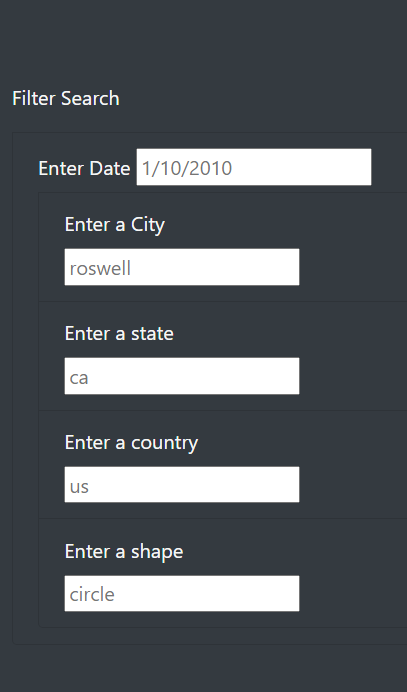
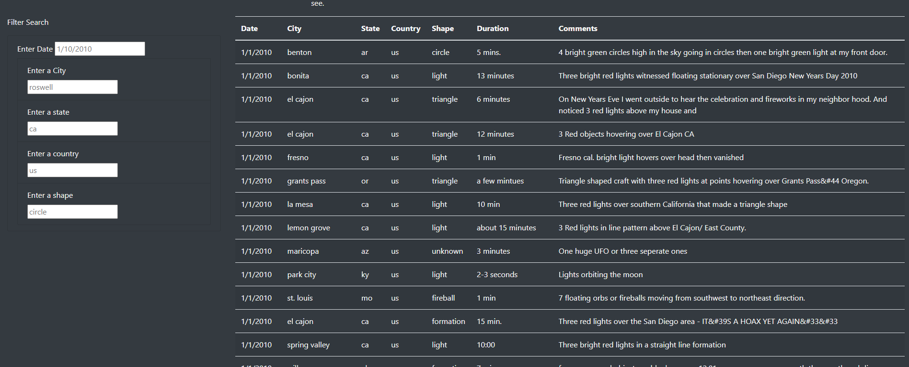
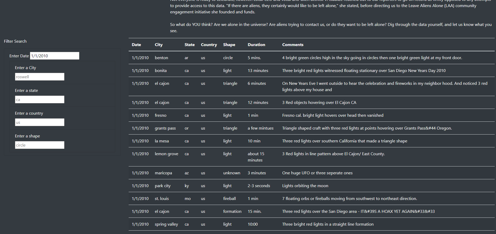
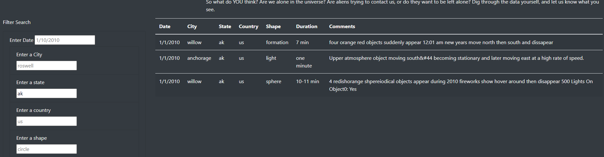
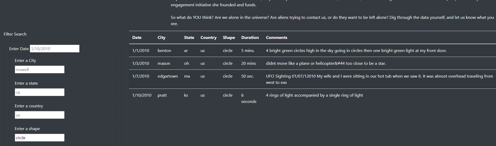

# UFOs - Challenge Number Eleven 

## Overview of the Analysis

The overview of this analysis was to assist Dana, a data journalist with her article on McMinnville, Oregon home to many UFO sightings and gatherings of UFO and alien enthusiasts.  By using JavaScript, we were able to filter the large amount of data to support UFO sightings across the country and world.  We were able to then provide a presentable table that can be sorted by date, city and country by any given user input.  The end result of the analysis was to provide interested parties with specific evidence on a website such as the shape and location of the sighting in connection with an article that is largely opinion based. 

## Results

*** 

Filtering Results

After setting our index.html and app.js files to the appropriate specifications, we were able to produce a section of our website that allows the user to search for a particular UFO sighting based on the criteria that they input into the search box.  When the user presses enter, it allows them to see filtered results based only on what they are looking for.  The following images show the search boxes as they appear and how the resuts appear unfiltered.

 

When a user would like to search for UFO sightings based on a specific date, they can input those specifications and the results on the website will appear accordingly.  For example, the following images show the filter using 1/1/2010 as the date.

* Filtering Results by Date

When a user would like to search for UFO sightings based on a specific date, they can input those specifications and the results on the website will appear accordingly.  For example, the following image shows the filter using 1/1/2010 as the date.

* Filtering Results by Location 

The results may be also be filtered by city, state or country as well.  The following image shows the filter using ak as the state. 

* Filtering Results by Shape

Lastly, a user can search by a specific shape.  For the purposes of searching, the following filter used was "circle" but there can be any number of shapes such as a triangle, chevron or sphere that will populate data based on that shape. 

### 

## Summary

In conclusion, while the black and white style of the website is certainly eye catching, it is not the most user friendly for those who are visually impaired.  The dark background makes it so that your attention is not drawn to the text.  While the data is necessary to support the UFO claims, it is a lot of text to look at, perhaps we could add more images to support the sightings and break up the text.  
